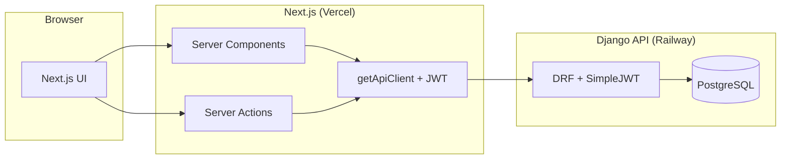

# Turbo Notes

A full-stack note-taking app built with a **Turborepo** monorepo: **Next.js** frontend and **Django** backend, with shared TypeScript types generated from the API schema.

**Live app:** [https://turbo-notes-frontend-nine.vercel.app/](https://turbo-notes-frontend-nine.vercel.app/) (frontend on Vercel, API on Railway).

---

## Table of contents

- [Architecture](#architecture)
- [Repo structure](#repo-structure)
- [How it works](#how-it-works)
- [Setup](#setup)
- [Scripts](#scripts)
- [Build process summary](#build-process-summary)
- [Design & technical decisions](#design--technical-decisions)
- [AI tools used](#ai-tools-used)
- [Deployment](#deployment)

---

## Architecture

The app uses a **backend-for-frontend** style: the browser only talks to the Next.js app. All API calls go through the Next.js server (Server Components and Server Actions), which then calls the Django API with the user’s JWT. Auth is httpOnly cookies only (no tokens in the browser).



**High-level flow**

1. **Browser** → requests pages and submits forms to the **Next.js** app (Vercel or local).
2. **Next.js** (Server Components / Server Actions) reads the JWT from httpOnly cookies, creates an API client with `getApiClient(token)`, and calls the **Django** API.
3. **Django** (DRF + SimpleJWT) validates the token, runs views/serializers, and talks to **PostgreSQL** (or SQLite in local dev).
4. **Types**: OpenAPI schema from Django (`drf-spectacular`) → `openapi-typescript` → `@turbo-notes/types`. The frontend and API client use these types only; no hand-written API response types.

---

## Repo structure

```
turbo-notes/
├── apps/
│   ├── backend/          # Django 4.2 + DRF + SimpleJWT
│   │   ├── config/       # Settings, URLs, WSGI
│   │   ├── accounts/     # Custom User (email), auth endpoints
│   │   ├── notes/        # Categories, Notes, default categories
│   │   ├── manage.py
│   │   ├── requirements.txt
│   │   └── Procfile      # For Railway: migrate + gunicorn
│   └── frontend/         # Next.js 16 App Router
│       ├── app/          # Routes: (auth), notes/[id], page (dashboard)
│       ├── components/    # UI, auth, dashboard, notes
│       ├── lib/          # API client, actions, hooks, routes, date
│       └── __tests__/
├── packages/
│   └── types/            # OpenAPI → TypeScript (openapi-typescript + openapi-fetch)
├── turbo.json
├── package.json          # pnpm workspace root
├── DEPLOYMENT.md         # Vercel + Railway deployment
└── README.md
```

---

## How it works

- **Auth**: Register/login hit Django `/api/auth/register/` and `/api/auth/token/`. Next.js stores `access_token` and `refresh_token` in httpOnly cookies and redirects. No localStorage.
- **Data**: Dashboard and note pages are Server Components. They read the token from `cookies()`, call `getApiClient(token)` and fetch categories/notes from the API. Mutations (create/update/delete note) use Server Actions that call the same API with the cookie-derived token.
- **Types**: `packages/types` exposes the generated API types and the typed client. Frontend imports from `@turbo-notes/types` and uses `createApiClient` from `@turbo-notes/types/client` with `openapi-fetch`. Backend schema is the single source of truth.

---

## Setup

### Prerequisites

- **Node.js** ≥ 18 and **pnpm**
- **Python** 3.9+ (backend)

### 1. Clone and install Node dependencies

```bash
git clone https://github.com/alexarevalo9/turbo-notes
cd turbo-notes
pnpm install
```

### 2. Backend (Django)

```bash
cd apps/backend
python3 -m venv venv
source venv/bin/activate   # Windows: venv\Scripts\activate
pip install -r requirements.txt
```

Copy env and run migrations:

```bash
cp .env.example .env
# Edit .env if needed (SECRET_KEY, ALLOWED_HOSTS, etc.)
python manage.py migrate
```

Start the backend (from repo root, backend runs via turbo):

```bash
# From repo root
pnpm dev
```

Or only the backend:

```bash
cd apps/backend && source venv/bin/activate && python manage.py runserver
```

### 3. Frontend env

```bash
cd apps/frontend
cp env.example .env.local
```

Keep `NEXT_PUBLIC_API_URL=http://localhost:8000` for local dev (no trailing slash).

### 4. Generate API types (optional for first run)

Backend must be running. From repo root:

```bash
pnpm run generate:types
```

This fetches the OpenAPI schema from `http://localhost:8000/api/schema/` and regenerates `packages/types`.

### 5. Run the app

From repo root:

```bash
pnpm dev
```

- Frontend: [http://localhost:3000](http://localhost:3000)
- Backend API: [http://localhost:8000](http://localhost:8000)
- OpenAPI schema: [http://localhost:8000/api/schema/](http://localhost:8000/api/schema/)

---

## Scripts

| Command                   | Description                                        |
| ------------------------- | -------------------------------------------------- |
| `pnpm dev`                | Run frontend + backend (turbo)                     |
| `pnpm build`              | Build all apps (types → frontend)                  |
| `pnpm test`               | Run tests (e.g. frontend Vitest)                   |
| `pnpm run generate:types` | Regenerate `@turbo-notes/types` from Django schema |
| `pnpm lint`               | Lint all packages                                  |
| `pnpm check-types`        | Type-check all packages                            |

---

## Build process summary

1. **Monorepo**: Started from a Turborepo template; replaced default apps with `frontend` (Next.js) and `backend` (Django).
2. **Backend**: Custom User (email-based), JWT auth (SimpleJWT), `accounts` and `notes` apps. Default categories created on register. API documented with drf-spectacular (OpenAPI).
3. **Types**: Added `packages/types` with openapi-typescript and openapi-fetch; `generate:types` script calls the running backend schema endpoint so the frontend never defines API response types by hand.
4. **Frontend**: Next.js App Router, Server Components for data, Server Actions for mutations. Central API helper (`lib/api.ts`) using the generated client; auth via httpOnly cookies only.
5. **UI**: Sign up / login, dashboard with category sidebar and note cards, note editor with category dropdown and auto-save. Styling with Tailwind; shadcn/ui for components.
6. **Deploy**: Backend configured for Railway (Procfile, `DATABASE_URL`, `CORS_ALLOWED_ORIGINS`); frontend for Vercel; deployment steps documented in `DEPLOYMENT.md`.

---

## Design & technical decisions

| Decision                         | Rationale                                                                                                                                      |
| -------------------------------- | ---------------------------------------------------------------------------------------------------------------------------------------------- |
| **OpenAPI as source of truth**   | One schema (Django + drf-spectacular) drives TypeScript types and the client. Avoids drift and duplicate type definitions.                     |
| **Server-only API calls**        | All requests to the Django API go from the Next.js server with the cookie-derived JWT. Simpler security and CORS; no token in the browser.     |
| **httpOnly cookies for auth**    | Reduces XSS risk; refresh/access tokens not readable by JS.                                                                                    |
| **Server Components first**      | Dashboard and note pages fetch data on the server; client components only where needed (e.g. note editor form, debounced auto-save).           |
| **Default categories on signup** | “Random Thoughts”, “School”, “Personal” created in `notes.services.create_default_categories` so every user has a usable sidebar from day one. |
| **Turborepo**                    | Single repo for frontend, backend config, and shared types; clear build order (types before frontend) and one-command dev/build/test.          |
| **TDD on backend**               | API tests (pytest-django) written before or alongside views/serializers to keep the API contract stable.                                       |

---

## AI tools used

- **Cursor** — AI-assisted editing and generation throughout the project.
- **MCP for Figma** — Design context and assets from Figma via the Model Context Protocol.
- **Cursor rules** — Project conventions and constraints are defined in [`.cursor/rules/`](.cursor/rules/) (architecture, backend, frontend, testing, types). Cursor applies these when editing in the repo.
- **Cursor skills** — Project-specific behavior and patterns defined in [`.cursor/skills/`](.cursor/skills/).

---

## Deployment

- **Frontend**: Vercel (see [DEPLOYMENT.md](./DEPLOYMENT.md)).
- **Backend**: Railway with PostgreSQL; env vars and Procfile described in [DEPLOYMENT.md](./DEPLOYMENT.md).

Set `NEXT_PUBLIC_API_URL` on Vercel to your Railway backend URL, and `CORS_ALLOWED_ORIGINS` on Railway to your Vercel frontend URL.
